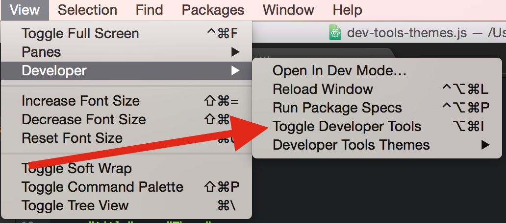
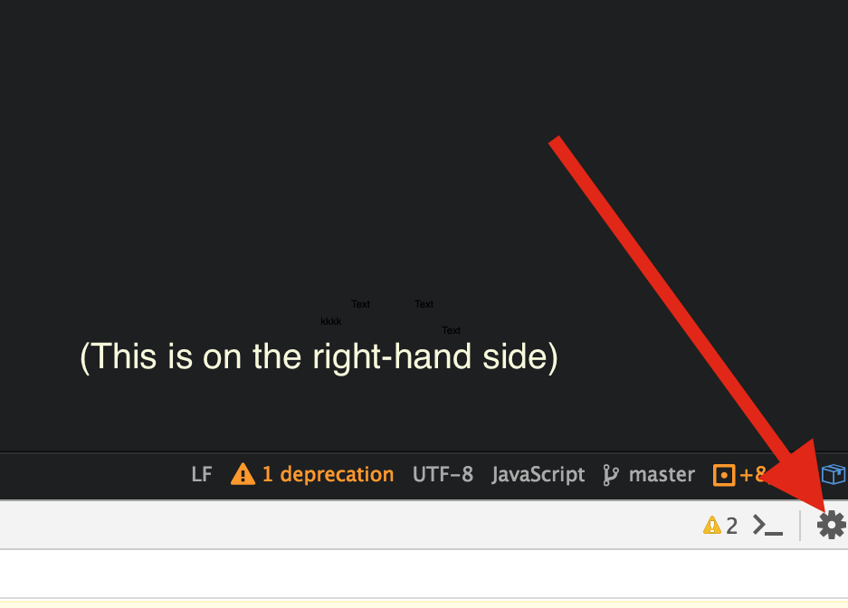
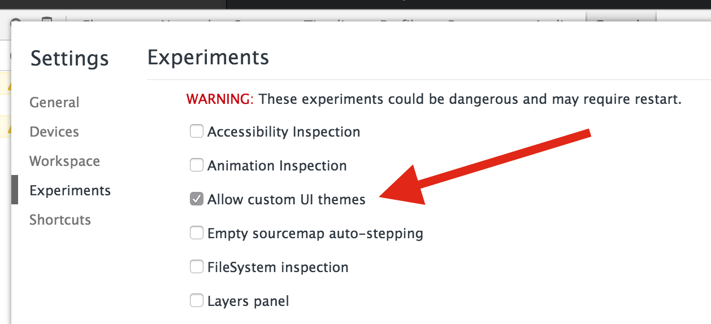

In order to use custom themes for the Developer Tools, a setting must be enabled manually.

1. **First open the dev tools**

  - 

2. **Then click the settings cog**

  - 

3. **And tick "Allow custom UI themes"**

 - 

#### Note:
This is the only way I was able to enable this feature (manually).
If anyone knows of a programmatic or easier way to set this, please let me know!
